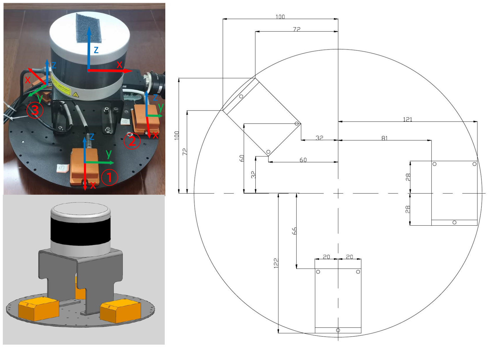
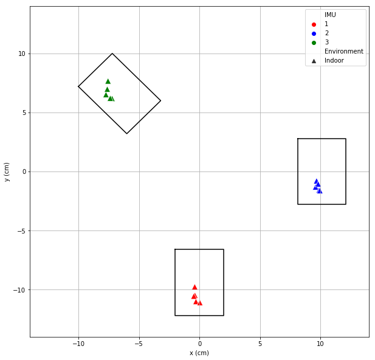
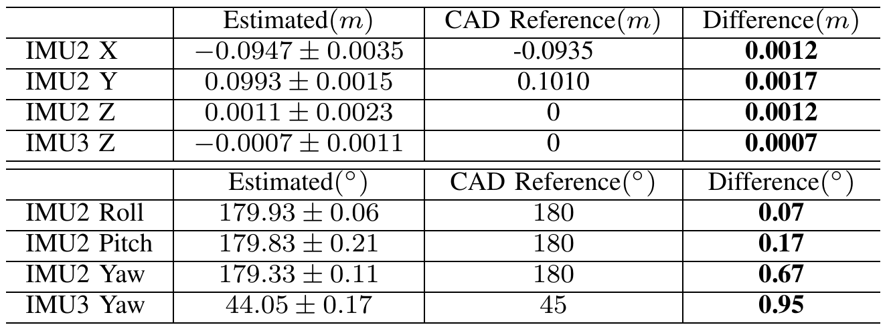

**The code will be available soon.**

# lidar_IMU_calib

**lidar_IMU_calib** is a framework for calibrating the transformation between the 3D LiDAR and IMU. It's based on continuous-time batch estimation. IMU-based cost and LiDAR point-to-plane distance are minimized jointly, which renders the calibration problem well-constrained in general scenarios.

**Author**: Jiajun Lv and Kewei Hu and Jinhong Xu from [APRIL Lab](https://github.com/APRIL-ZJU)

**Related Paper:** Jiajun Lv, Jinhong Xu, Kewei Hu, Yong Liu, Xingxing Zuo. Targetless Calibration of LiDAR-IMU System Based on Continuous-time Batch Estimation. [[arxiv](https://arxiv.org/pdf/2007.14759.pdf)]

### Results

We have tested the proposed method in the following self-assemble sensors. 

Due to the absence of ground-truth extrinsic transformation between LiDAR and IMU in real-world experiments and the lack of open-sourced LiDAR-IMU calibration algorithms, the relative poses of three IMU inferred from CAD assembly drawings are introduced as references. 

**Top view of the calibration results**

**Relative rotation and translation calibration results**

Here are the relative rotation and translation calibration results of IMU2 (or IMU3) w.r.t. IMU1 compared with CAD reference over the datasets collected from a garage. The differences between the estimated with the CAD reference are small.

